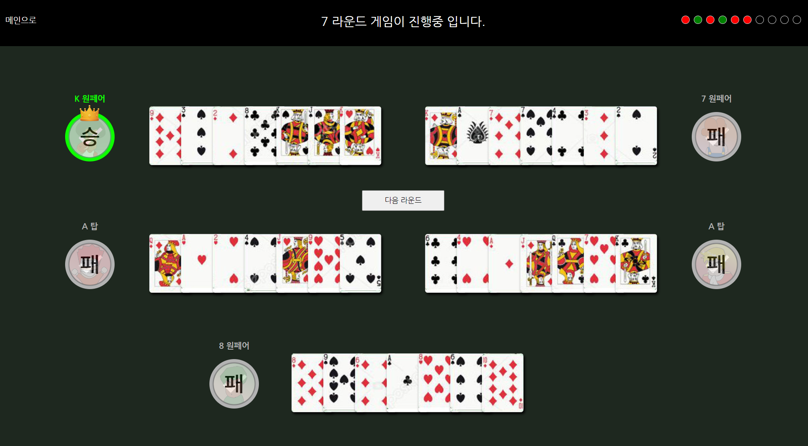

# 포커 게임

사용 노드 버젼 : 20.13.1

저장소 : https://github.com/frontchoi/Poker

-   <strong>탑 → 1페어 → 2페어 → 트리플 → 플러시 → 풀하우스 → 포카드</strong> 까지만 구현되어있고 오
    픈된 카드들을 확인 후 해당 라운드의 승자를 예측하는게임입니다.

-   <strong>총 10번</strong>의 라운드를 진행합니다.

-   플레이어의 <strong>패는 항상 공개</strong>됩니다.

## 
